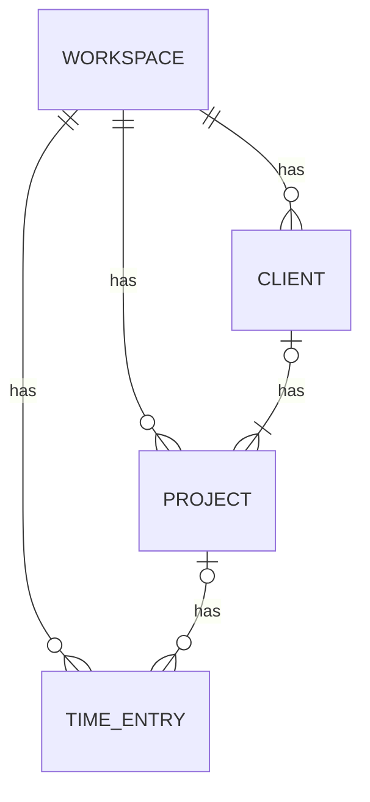

# Toggl Tally

[](https://pypi.org/project/toggl-tally/) [](https://badge.fury.io/py/toggl-tally)

[](https://github.com/twolffpiggott/toggl-tally/actions/workflows/test.yml)

Toggl tally is a rich Python command line interface for tracking progress against your monthly project targets and calculating the daily hours you need to work to hit your goals. Toggl tally connects to the [Toggl Track API](https://developers.track.toggl.com/), and supports:

- Filtering by workspaces, clients or projects
- Configurable invoicing day of month
- Configurable weekly working days
- Excluding (and reporting upcoming) public holidays in your configured country

<p align="center">
  
</p>

## Installation

Install using `pip`:

```
pip install toggl-tally
```

## Setup

### Toggl API token

Toggl tally handles connection to the [Toggl Track API](https://developers.track.toggl.com/); all you need to do is make your Toggl API token available as an environment variable. Get your Toggl API token from the [Toggl profile page](https://track.toggl.com/profile) and set it as the `TOGGL_API_TOKEN` environment variable.

### Configuration

Toggl tally needs to be configured with your monthly goals and projects. This configuration can be passed either via a YAML file or via command line arguments and options. YAML file configuration is the most streamlined and DRY for daily use.

The path to the YAML config file can either be passed as a command-line argument (`toggl-tally -c /path/to/config.yaml`) or can be detected automatically from the environment variable `TOGGL_TALLY_CONFIG`.


The configurable keys are as below, and a full example [yaml config](https://github.com/twolffpiggott/toggl-tally/blob/main/config.yml) is provided with this repo.

```yaml
hours_per_month: 160
invoice_day: 18
workspaces:
clients:
  - MegaCorp
projects:
  - Widget Building
skip_today: false
timezone: Africa/Johannesburg
working_days:
  - MO
  - TU
  - WE
  - TH
  - FR
country: ZA
exclude_public_holidays: true
```

Alternatively, all configuration can be passed with command-line arguments to the `hours` command. See the CLI help for detailed information about each argument and option.


## Toggl data model and filtering



`toggl_tally` enables filtering by multiple workspace, client or project names. The UNION across all of these entities is taken to determine the final set of time entries. For example, for the filter criteria:

```yaml
workspaces:
clients:
  - MegaCorp
  - HyperCorp
projects:
  - Widget Building
  - Baz refactoring
```

A time entry will be included if it:

- Belongs to a project linked to the MegaCorp client OR
- Belongs to a project linked to the HyperCorp client OR
- Belongs to the Widget Building project OR
- Belongs to the Baz refactoring project

## Hours command

The `hours` command is the core command for Toggl tally. It reports:

- Working days to go before next invoice date
- Daily hours needed to hit monthly target by next invoice date
- Hours worked on relevant projects since last invoice
- A monthly progress bar


The `hours` command has a `--verbose` (`-v`) flag, which if enabled also reports:

- Active workspace, project and client filters
- Upcoming public holidays in the working period


## Development

To install `toggl_tally` for development, run:

```bash
pip install -e '.[dev]'
```

Code for this repository is checked using [pre-commit](https://pre-commit.com/). After cloning this repository please run the following steps to initialise pre-commit:

```bash
pre-commit install --install-hooks
```

The following hooks are automatically run when new commits are made:

- From [pre-commit hooks](https://github.com/pre-commit/pre-commit-hooks):
    - end-of-file-fixer
    - trailing-whitespace
    - check-yaml
    - check-added-large-files (max. 500kb)
- [black](https://github.com/psf/black) Python code format checking
- [flake8](https://gitlab.com/pycqa/flake8) Python code linting
- [isort](https://github.com/PyCQA/isort) Python code import ordering
