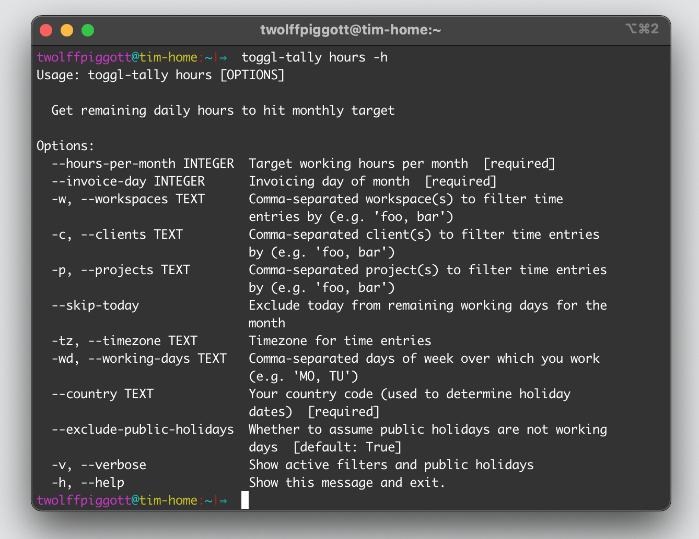

# Toggl Tally


## Setup

### Toggl API token

Get your Toggl API token from the [Toggl profile page](https://track.toggl.com/profile) and set it as the `TOGGL_API_TOKEN` environment variable.

### Configuration

The `toggl-tally` CLI can be configured via a yaml file. The path to this file can either be passed as a command-line argument (`toggl-tally -c /path/to/config.yaml`) or can be detected automatically from the environment variable `TOGGL_TALLY_CONFIG`.


The configurable keys are as below, and as in the example [config](config.yml).

```yaml
hours_per_month: 160
invoice_day: 18
workspaces:
clients:
  - MegaCorp
projects:
  - Widget Building
skip_today: false
timezone: Africa/Johannesburg
working_days:
  - MO
  - TU
  - WE
  - TH
  - FR
country: ZA
exclude_public_holidays: true
```

Alternatively, all configuration can be passed with command-line arguments to the `hours` command. See the CLI help for detailed information about each argument and option.



## Installation

To install `toggl_tally`, run:

```bash
pip install --editable .
```

## Development

Code for this repository is checked using [pre-commit](https://pre-commit.com/).

After cloning this repository please run the following steps to initialise pre-commit:

```bash
pip install pre-commit
pip install -r requirements/requirements_dev.txt
pre-commit install --install-hooks
```

The following hooks are automatically run when new commits are made:

- From [pre-commit hooks](https://github.com/pre-commit/pre-commit-hooks):
    - end-of-file-fixer
    - trailing-whitespace
    - check-yaml
    - check-added-large-files (max. 500kb)
- [black](https://github.com/psf/black) Python code format checking
- [flake8](https://gitlab.com/pycqa/flake8) Python code linting
- [isort](https://github.com/PyCQA/isort) Python code import ordering
